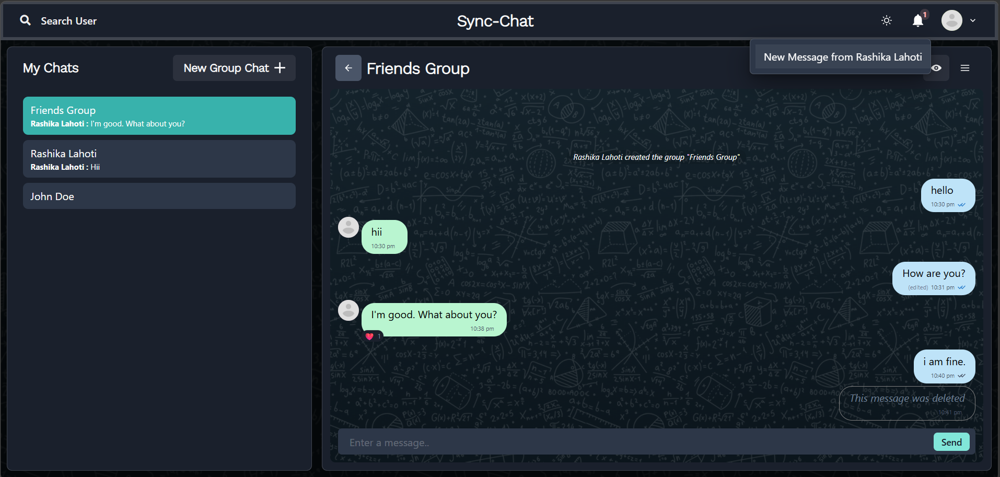
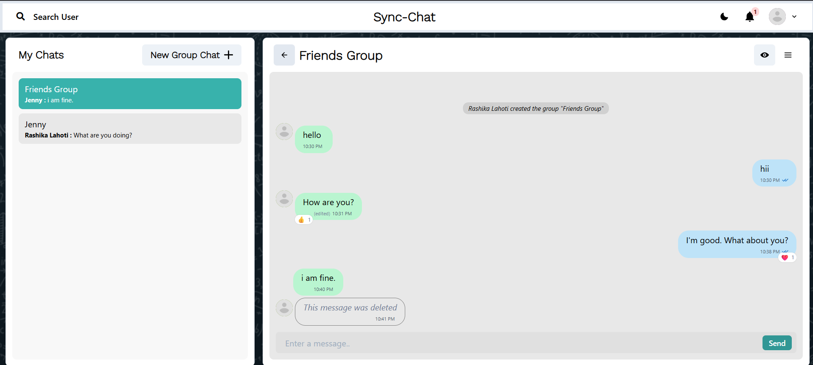
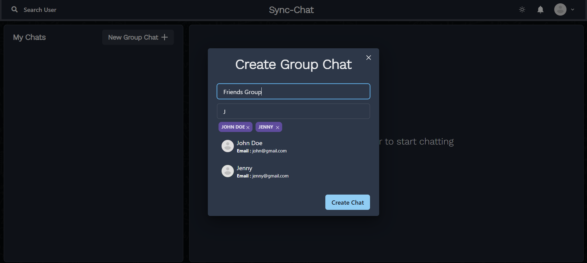

# Sync-Chat

Sync-Chat is a Full Stack Chatting App.
Uses Socket.io for real time communication and stores user details in encrypted format in Mongo DB Database.
## Tech Stack

**Client:** React JS

**Server:** Node JS, Express JS

**Database:** Mongo DB
  
## Demo

[https://talk-a-tive.herokuapp.com/](https://talk-a-tive-7fgq.onrender.com)


## Run Locally

Clone the project

```bash
  git clone https://github.com/RashikaLahoti/Sync-Chat.git
```

Go to the project directory

```bash
  cd Sync-Chat
```

Install dependencies

```bash
  npm install
```

```bash
  cd frontend/
  npm install
```

Start the server

```bash
  npm run start
```
Start the Client

```bash
  //open now terminal
  cd frontend
  npm start
```

  
# Features

### Authenticaton
.png)
.png)
### Real Time Chatting with Typing indicators
.png)
### One to One chat
.png)
### Light Theme

### Search Users
.png)
### Create Group Chats



## Made By

- [@RashikaLahoti](https://github.com/RashikaLahoti)

  
